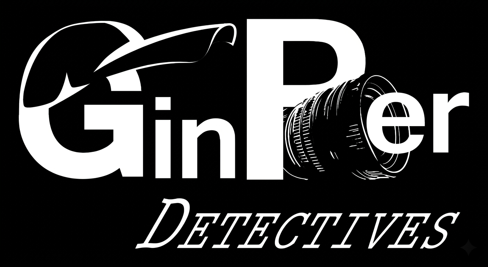

<div align="center">

 

### *— Cádiz, Ciudad de los Vientos y los Secretos —*

---

🔍 &nbsp; **Gestión profesional de casos para detectives privados** &nbsp; 🔍

[](https://laravel.com)
[](https://react.dev)
[](https://php.net)
[](https://mysql.com)
[](LICENSE)

</div>

---

## 🕵️ El Caso

> *"En esta ciudad, entre el rumor del mar y el susurro de las callejuelas, hay quien busca la verdad a toda costa. Yo me encargo de encontrarla."*

**GP Detective** es una aplicación web fullstack diseñada para un detective privado con base en **Cádiz**. Combina una plataforma de administración de casos con una web pública que muestra los servicios ofrecidos, todo envuelto en la estética del noir clásico de los años 40.

El proyecto nace como Trabajo de Fin de Grado, integrando un backend robusto en **Laravel** con un frontend moderno en **React**, para demostrar que la investigación privada también puede digitalizarse con clase.

---

## 🗂️ El Expediente — Funcionalidades

<table>
<tr>
<td width="50%">

### 🏛️ Panel Público
- Presentación del detective y sus servicios
- Diseño noir blanco y negro temático
- Formulario de contacto para nuevos clientes
- Información sobre casos resueltos (sin datos sensibles)
- Diseño responsive para todos los dispositivos

</td>
<td width="50%">

### 🔐 Panel Privado (Admin)
- Gestión completa de casos (CRUD)
- Registro de clientes e investigados
- Seguimiento del estado de cada investigación
- Almacenamiento de evidencias y notas
- Panel de control con estadísticas

</td>
</tr>
</table>

---

## 🛠️ El Arsenal — Tecnologías

```
┌─────────────────────────────────────────────────────────┐
│                    STACK TECNOLÓGICO                     │
├──────────────────────┬──────────────────────────────────┤
│  BACKEND             │  FRONTEND                        │
│  ─────────────────   │  ─────────────────────────────   │
│  Laravel 12          │  React 19                        │
│  PHP 8.3             │  Inertia.js                      │
│  MySQL / SQLite      │  Tailwind CSS                    │
│  Laravel Breeze      │  Vite                            │
│  Eloquent ORM        │  Axios                           │
│  API RESTful         │  React Router                    │
└──────────────────────┴──────────────────────────────────┘
```

---

## 📁 Estructura del Caso

```
TFG/
└── gpDetective/
    ├── app/
    │   ├── Http/
    │   │   ├── Controllers/     # Controladores de la lógica
    │   │   └── Middleware/      # Autenticación y permisos
    │   └── Models/              # Modelos Eloquent
    ├── database/
    │   ├── migrations/          # Estructura de la base de datos
    │   └── seeders/             # Datos de prueba
    ├── resources/
    │   ├── js/                  # Componentes React
    │   │   ├── Components/
    │   │   └── Pages/
    │   └── views/               # Vistas Blade base
    ├── routes/
    │   ├── web.php              # Rutas web
    │   └── api.php              # Rutas de la API
    └── public/                  # Assets públicos
```

---

## ⚙️ Instrucciones de Campo — Instalación

Sigue estos pasos para poner en marcha la investigación en tu entorno local:

### Prerrequisitos

Antes de comenzar, asegúrate de tener instalado:
- **PHP** >= 8.2
- **Composer** >= 2.x
- **Node.js** >= 20.x y **npm**
- **MySQL** 8.0 o **SQLite**

### 1. Clonar el repositorio

```bash
git clone https://github.com/Javivu748/TFG.git
cd TFG/gpDetective
```

### 2. Instalar dependencias

```bash
# Dependencias PHP
composer install

# Dependencias JavaScript
npm install
```

### 3. Configurar el entorno

```bash
# Copiar el archivo de configuración
cp .env.example .env

# Generar la clave de la aplicación
php artisan key:generate
```

Edita el archivo `.env` con los datos de tu base de datos:

```env
DB_CONNECTION=mysql
DB_HOST=127.0.0.1
DB_PORT=3306
DB_DATABASE=gp_detective
DB_USERNAME=tu_usuario
DB_PASSWORD=tu_contraseña
```

### 4. Configurar la base de datos

```bash
# Ejecutar las migraciones
php artisan migrate

# (Opcional) Cargar datos de ejemplo
php artisan db:seed
```

### 5. Arrancar los servidores

```bash
# En una terminal — servidor Laravel
php artisan serve

# En otra terminal — compilar assets React
npm run dev
```

🔎 Accede a `http://localhost:8000` y el caso está abierto.

---

## 🗺️ Diligencias Pendientes — Roadmap

- [x] Estructura base Laravel + React
- [x] Autenticación y panel de administración
- [x] Gestión de casos (CRUD)
- [x] Web pública con diseño noir
- [x] Formulario de contacto
- [ ] Módulo de evidencias con subida de archivos
- [ ] Generación de informes en PDF
- [ ] Notificaciones por email al cliente
- [ ] Versión móvil optimizada

---

## 🤝 Colaboradores

<div align="center">

|  |
|:---:|
| **Javivu748** |
| *Jefe de la investigación* |
| [](https://github.com/Javivu748) |

</div>

---

## 📜 Licencia

Este proyecto está bajo la licencia **MIT** — consulta el archivo [LICENSE](LICENSE) para más detalles.

---
